# Integrated Infrastructure and Delivery

I built this project to bring together tools I had previously used in separate projects: Terraform, AWS, Docker, Kubernetes, and GitHub Actions. I reused my small System Health API so I could focus on how infrastructure is created and how a tested application reaches a working Kubernetes deployment.

I deployed the application to Amazon EKS in `eu-central-1`, verified the running Pods and public API, and collected the screenshots below. The AWS environment was temporary: the application URL shown in the screenshots is deployment evidence, not a permanent live service. Because EKS, its EC2 node, and the load balancer incur charges while they exist.

## What I Built

I connected the following parts into one deployment:

- Terraform creates the VPC, public subnets, routing, ECR repository, EKS cluster, managed node group, and IAM resources.
- Docker packages the System Health API as an image that runs with a non-root user.
- GitHub Actions tests the application and validates the Terraform and Kubernetes configuration.
- A separate deployment workflow builds the tested Git commit, pushes its image to ECR, and deploys that exact image to EKS.
- Kubernetes keeps two application replicas running and exposes them through a Service of type `LoadBalancer`.
- The `/version` endpoint reports the commit that was deployed, allowing me to connect the live application to its workflow run and ECR image.

There is no database, Helm chart, or additional monitoring platform in this project. The API is deliberately small because the infrastructure and delivery workflow are the main work.

## Architecture and Delivery Flow

I separated infrastructure provisioning from application delivery. Terraform creates the AWS resources first. It does not apply the Kubernetes YAML files. Once the cluster exists, the GitHub Actions deployment workflow connects to it and applies the Kubernetes resources.

The delivery sequence is:

1. A push or pull request runs Continuous Integration (CI): Python tests, a Docker build and container endpoint checks, Terraform formatting and validation, and Kubernetes manifest rendering checks.
2. After a successful CI run on `main`, the Continuous Deployment (CD) workflow selects that run's Git commit. CD can also be started manually.
3. GitHub Actions obtains short-lived AWS credentials using OpenID Connect (OIDC). It builds the Docker image and pushes it to Amazon ECR with the full Git commit SHA as its tag.
4. The deployment job connects to EKS, renders the Kubernetes YAML files, inserts the ECR image URI and the same commit SHA as `APP_VERSION`, and applies the result.
5. Kubernetes rolls out two replicas. The workflow waits for the rollout and load balancer, then checks `/`, `/health`, `/system`, and `/version` through the public endpoint.

The Kubernetes `LoadBalancer` Service created a **Classic Load Balancer** in this deployment. Terraform created the VPC and cluster, while Kubernetes requested the load balancer after the Service was applied.

## API Endpoints

| Endpoint | Response |
| --- | --- |
| `/` | Application name and available endpoints |
| `/health` | `{"status":"healthy"}` |
| `/system` | Container hostname, CPU, memory, disk usage, and uptime |
| `/version` | The deployed Git commit SHA supplied through `APP_VERSION` |

The values returned by `/system` change with the container and its environment. The application listens on container port `5000`. Kubernetes exposes it on Service port `80`.

## Docker and Kubernetes

I used a pinned Python base image and pinned application dependencies. Gunicorn serves the Flask application on port `5000`. The Dockerfile runs it as user `10001`, and the image health check requests the real `/health` endpoint.

The Kubernetes Deployment specifies two replicas and a rolling update that keeps the existing replicas available while replacement Pods become ready. Both the readiness and liveness probes call `/health`. I set CPU and memory requests and limits, disabled privilege escalation, removed Linux capabilities, and mounted a temporary directory so the container can keep its root filesystem read-only.

`Kubernetes/kustomization.yaml` groups the namespace, Deployment, and Service. The YAML file contains a local image reference, `system-health-api:0.1.0`, as its starting value. CD replaces it in the rendered manifest with an ECR image tagged with a specific Git commit; it also replaces the starting `APP_VERSION` value. The deployment therefore identifies the actual tested revision rather than relying on a mutable `latest` tag.

## Terraform and AWS

| Resource | Purpose |
| --- | --- |
| VPC, two public subnets, Internet Gateway, and route table | Provide networking for EKS nodes and the public load balancer |
| Amazon EKS cluster | Run the Kubernetes control plane |
| Managed node group | Provide one `t3.medium` EC2 worker node for the demonstration |
| Amazon ECR repository | Store commit-tagged container images |
| EKS cluster and node IAM roles | Allow EKS and its nodes to use the AWS services they require |
| GitHub OIDC provider and IAM role | Let CD push images and reach EKS without permanent AWS keys |
| EKS access entry and cluster access policy | Authorize the GitHub Actions role to deploy Kubernetes resources |

The defaults, including the region and resource names, are in `Terraform/variables.tf`; `Terraform/terraform.tfvars.example` shows the corresponding example values. Terraform outputs the cluster name, ECR repository URL, VPC ID, and GitHub Actions role ARN. I kept Terraform provisioning as a separate step so the CD workflow could focus on application releases.

## Continuous Integration and Deployment

`ci.yml` uses GitHub-hosted runners. Its three jobs test the Flask application and a running Docker container, run `terraform fmt -check` and `terraform validate`, and render/check the Kubernetes resources with `kubectl kustomize`. A failed required job prevents a successful CI conclusion.

`cd.yml` runs when CI completes successfully on `main` or when I start CD manually. It checks out the commit from the CI run, assumes the Terraform-created IAM role through OIDC, builds and pushes the image to ECR, and deploys to EKS. The deploy job depends on the image build job, waits for the rollout and the external address, and verifies all four API endpoints. The tested revision is visible in the ECR image tag and the deployed `/version` response.

The repository requires one GitHub Actions **repository variable** after provisioning:

| Variable | Value |
| --- | --- |
| `AWS_ROLE_ARN` | The value of Terraform output `github_actions_role_arn` |

I did not store AWS access keys or other credentials in GitHub or in the repository. For an actual deployment, the Terraform infrastructure must exist before the deployment workflow can use the output role and EKS cluster. I disabled CI and CD after collecting evidence so a later documentation commit would not start another deployment into a removed environment.

## Deployment Evidence

These screenshots show the temporary deployment before cleanup. The load balancer address in the browser screenshots is historical after the infrastructure is destroyed.

### GitHub Actions

The workflow overview shows CI and CD runs.

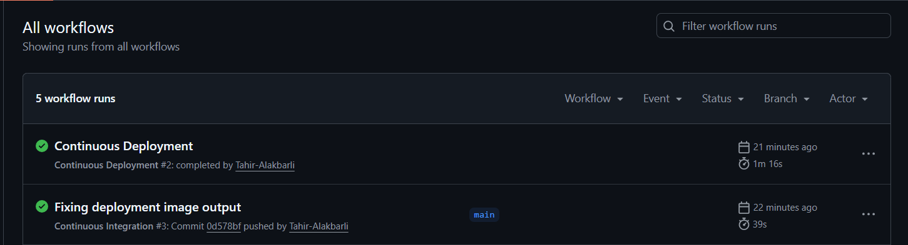

CI passed the application, Terraform, and Kubernetes checks.

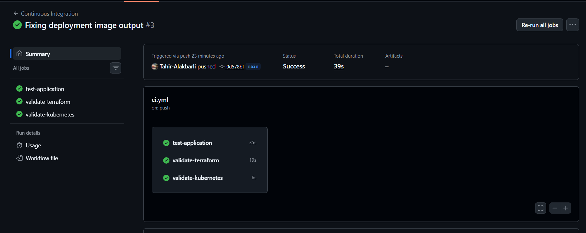

CD built and pushed the container, then deployed and verified it.

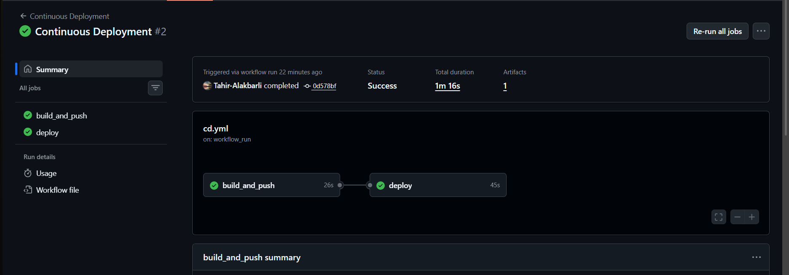

### AWS Infrastructure

Terraform created a VPC with two public subnets, routing, and an Internet Gateway.

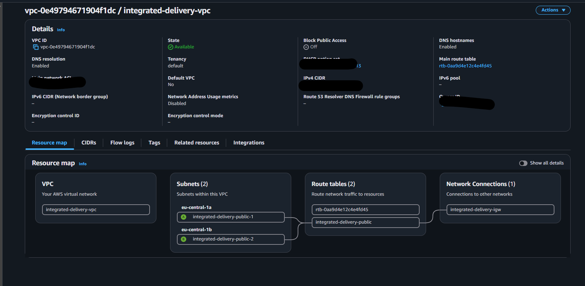

The EKS cluster reached the active state.

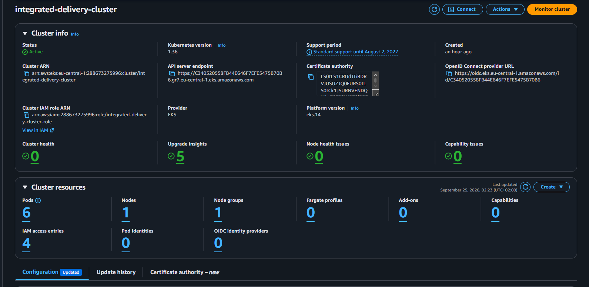

The managed node was ready to run workloads.

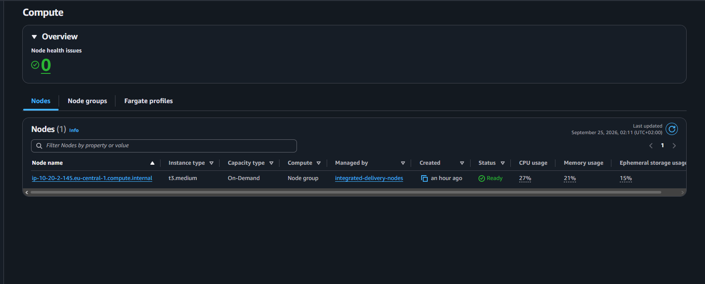

ECR stored the image under a full commit SHA tag.

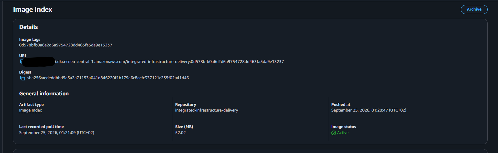

The Kubernetes Service provisioned a public Classic Load Balancer.

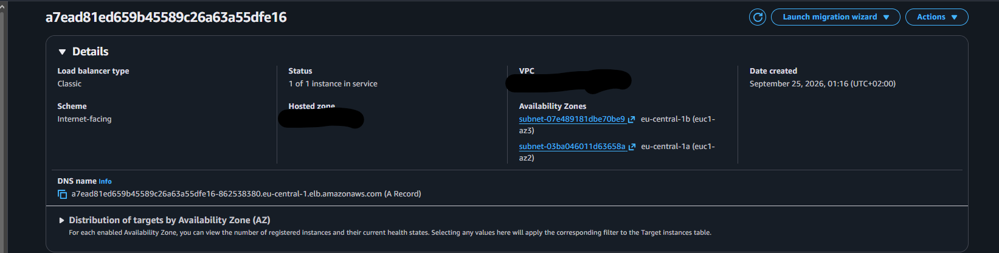

### Kubernetes Resources

The application Deployment had two desired and two ready replicas.

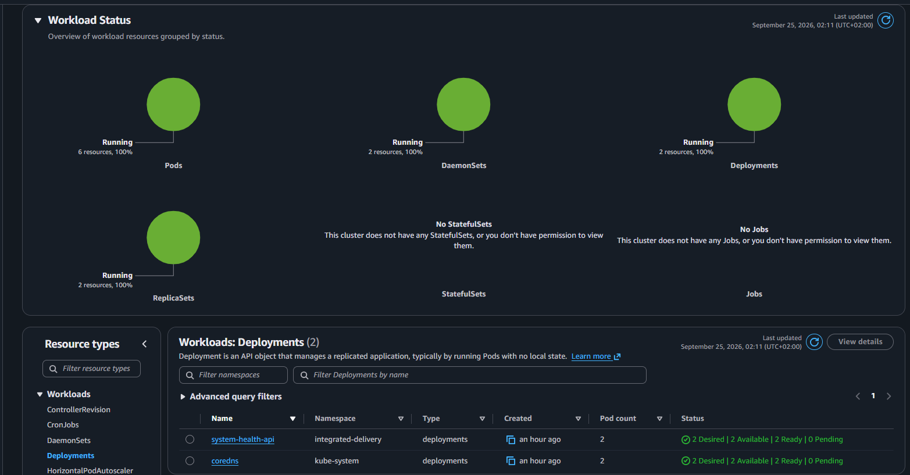

Both application Pods were running.

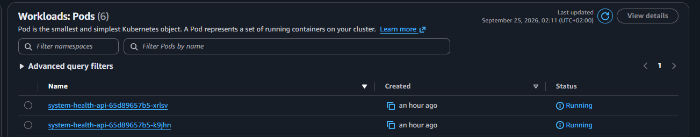

The Service exposed the application from its namespace.

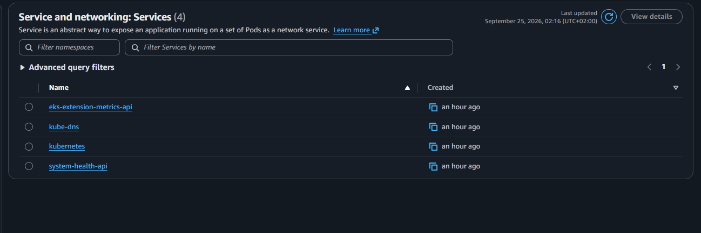

I also checked the node, Pods, and Service with `kubectl`.

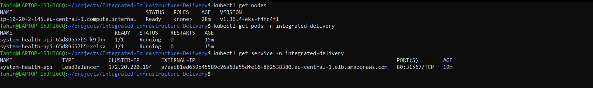

### Application

The deployed `/health` endpoint reported a healthy application.

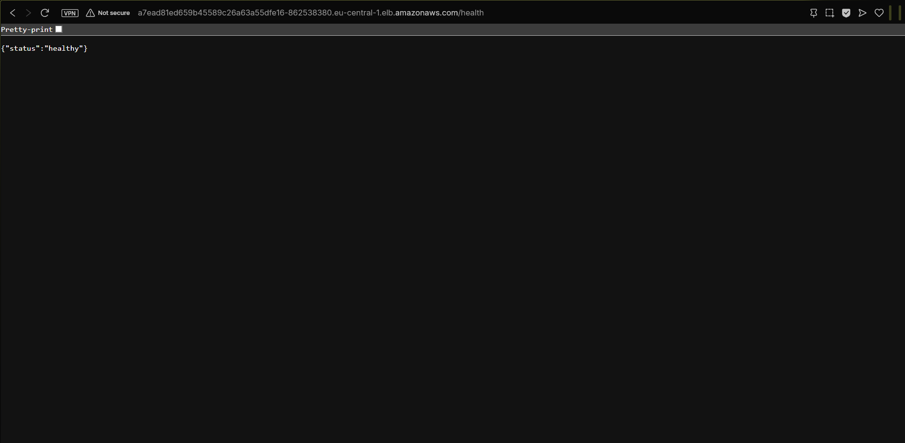

The deployed `/version` endpoint showed the same commit SHA used for the ECR image.

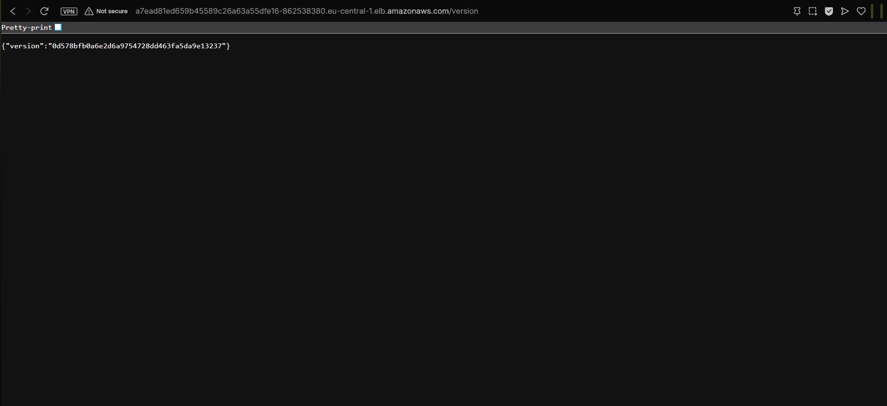

## Troubleshooting

### ECR Image URI Was Masked Between GitHub Actions Jobs

My first CD run pushed the image to ECR but did not finish the deployment. The credentials action masked the AWS account ID in the registry address. Because the image URI was passed as a job output, the downstream deploy job did not receive a usable ECR address.

I changed the `mask-aws-account-id` setting on the image-producing credentials step and reran the workflow. The next CD run built the image, deployed it, and verified the API. This did not require storing AWS access keys; OIDC still provided the AWS credentials for each job.

### Load Balancer Cleanup Order

The Kubernetes Service requested an AWS load balancer, so the load balancer was outside Terraform's state. Before destroying the EKS cluster, I deleted the `system-health-api` Service and checked that neither the Classic nor the newer load balancer API listed a load balancer in this project's VPC. This allows Kubernetes to remove its load balancer while the cluster still exists.

## Resource Cleanup

The deployment is intentionally temporary. My cleanup order is:

1. Disable the CI and CD workflows to prevent another automatic deployment.
2. Delete the Kubernetes `system-health-api` Service while the cluster is still available.
3. Check that the AWS load balancer is gone from this project's VPC.
4. Run `terraform -chdir=Terraform destroy` from the same checkout and Terraform state used for the deployment.
5. Confirm that Terraform state has no managed resources and that the EKS cluster, node group, ECR repository, and VPC are gone.

The ECR repository has `force_delete = true`, so its images are removed with the repository during Terraform cleanup. I keep Terraform state out of Git; it is needed locally for a controlled destroy. The GitHub workflows remain in the repository as documentation of the delivery process but are disabled once the AWS environment is removed.

## What I Learned

This project helped me connect the boundaries between tools. Terraform creates AWS infrastructure, but the Kubernetes YAML is applied separately by CD. An EKS cluster does not automatically read YAML files from the repository. I also saw how a Kubernetes Service can create an AWS load balancer that Terraform does not manage, why an image should be tied to a Git commit, and how AWS console identity affects access to Kubernetes objects. Finally, I practiced cleaning up in an order that leaves no chargeable project infrastructure behind.

## AI Usage

I used AI assistance to help with OIDC permission as to access AWS, Kubernetes resources, and exact ECR image URI tagged with the tested commit for the CI/CD workflow.
I also used it to with certain parts within Terraform code for correct structure. 
It was also used to verify the decisions of using EKS and ECR in order for them not incur costs for me. Also deciding when to stop with Terraform and continue with CD for application of Kubernetes YAML files, that boundary mattered because Kubernetes created Load Balancer outside Terraform's state.

## Sources

I used the following official documentation to check the infrastructure, deployment flow, and cleanup behavior:

### Terraform and AWS

- [Terraform AWS provider: EKS cluster](https://registry.terraform.io/providers/hashicorp/aws/latest/docs/resources/eks_cluster)
- [Terraform AWS provider: EKS managed node group](https://registry.terraform.io/providers/hashicorp/aws/latest/docs/resources/eks_node_group)
- [Terraform AWS provider: EKS access entry](https://registry.terraform.io/providers/hashicorp/aws/latest/docs/resources/eks_access_entry)
- [Terraform AWS provider: EKS access policy association](https://registry.terraform.io/providers/hashicorp/aws/latest/docs/resources/eks_access_policy_association)
- [Terraform AWS provider: ECR repository](https://registry.terraform.io/providers/hashicorp/aws/latest/docs/resources/ecr_repository)
- [Terraform AWS provider: IAM OpenID Connect provider](https://registry.terraform.io/providers/hashicorp/aws/latest/docs/resources/iam_openid_connect_provider)
- [Terraform destroy command](https://developer.hashicorp.com/terraform/cli/commands/destroy)
- [AWS: delete an EKS cluster and its load balancers](https://docs.aws.amazon.com/eks/latest/userguide/delete-cluster.html)

### GitHub Actions and Kubernetes

- [GitHub Actions: events that trigger workflows](https://docs.github.com/en/actions/reference/workflows-and-actions/events-that-trigger-workflows#workflow_run)
- [GitHub Actions: configuring OIDC for AWS](https://docs.github.com/en/actions/how-tos/secure-your-work/security-harden-deployments/oidc-in-aws)
- [Kubernetes: Services and external load balancers](https://kubernetes.io/docs/concepts/services-networking/service/#loadbalancer)
- [Kubernetes: liveness and readiness probes](https://kubernetes.io/docs/tasks/configure-pod-container/configure-liveness-readiness-startup-probes/)
- [Kubernetes: managing resources with Kustomize](https://kubernetes.io/docs/tasks/manage-kubernetes-objects/kustomization/)

### Application and Container

- [Dockerfile reference](https://docs.docker.com/reference/dockerfile/)
- [Flask documentation](https://flask.palletsprojects.com/)
- [Gunicorn documentation](https://docs.gunicorn.org/en/stable/)
- [pytest documentation](https://docs.pytest.org/en/stable/)
